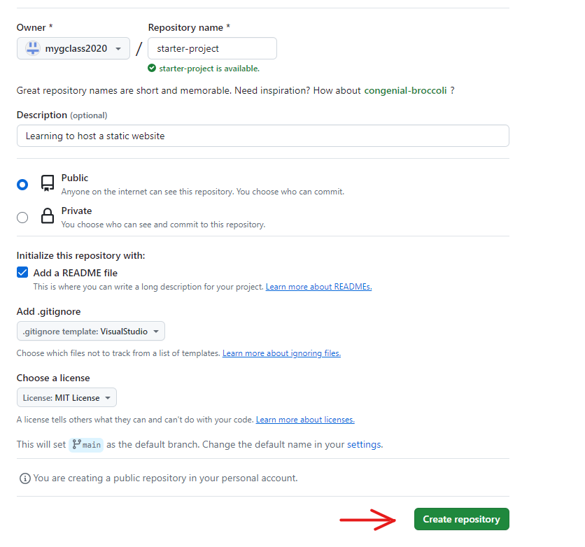
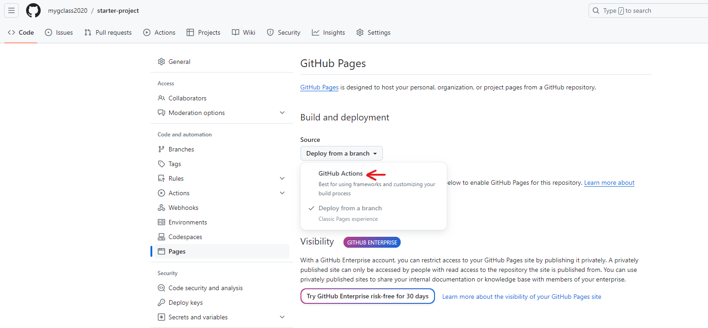
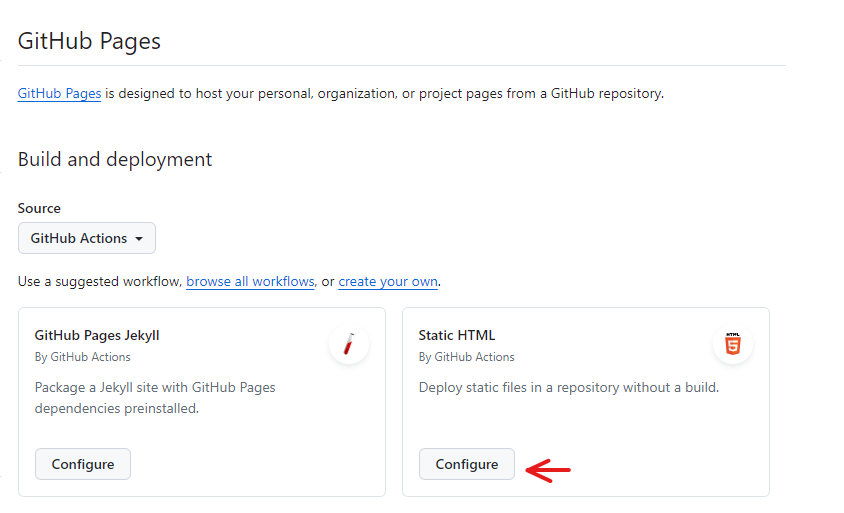
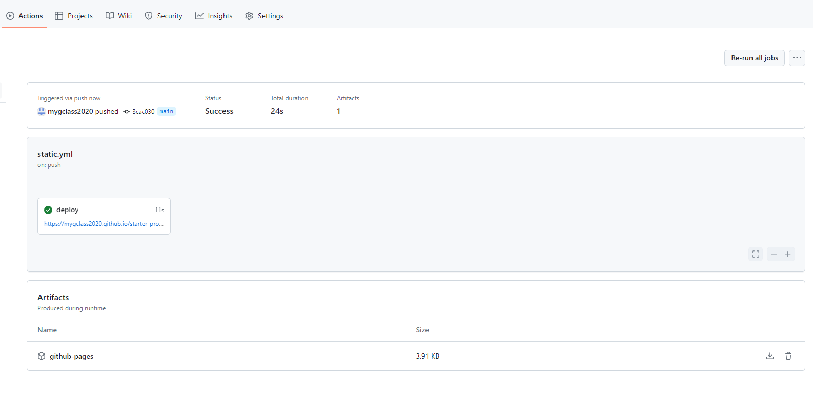
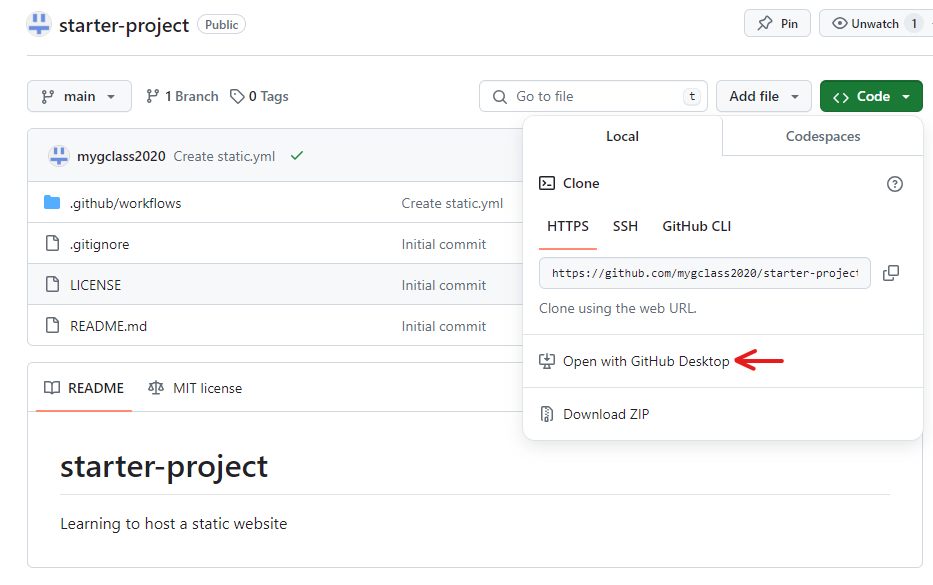
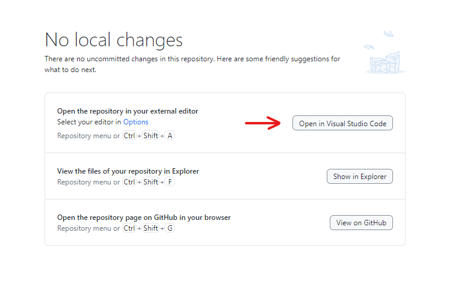
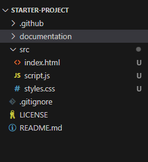
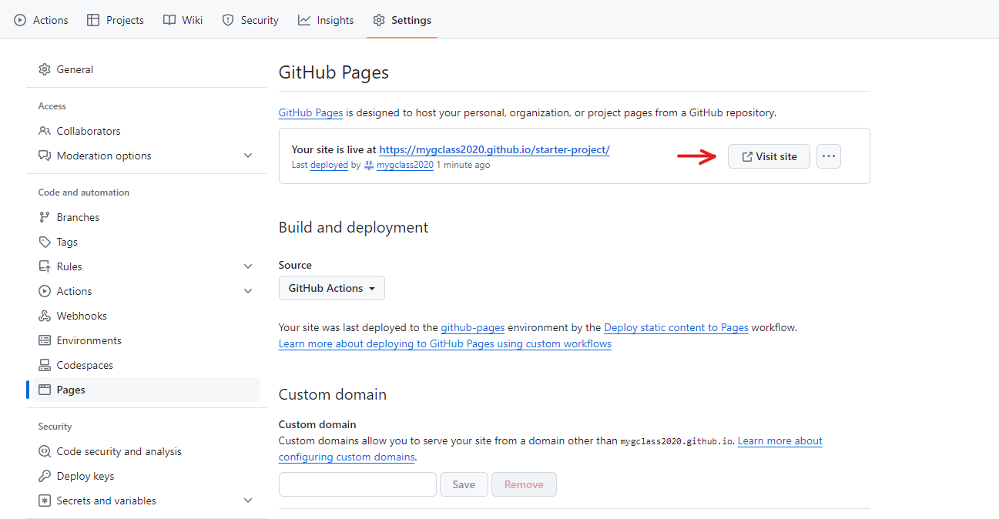
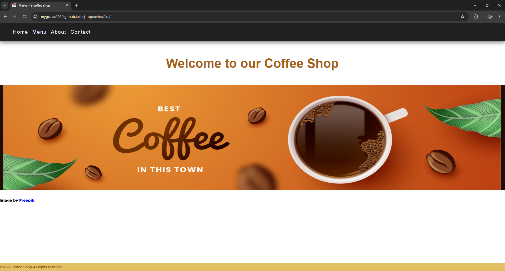
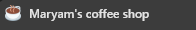

# hcj - topnavbar

## What are we doing today?

>1. [Learning to host a static website](#hosting-a-static-webpage)
>1. [Adding Html, Css and Javascript to your website](#adding-html-css-and-javascript-to-your-website)
>1. [Creating a favicon](#creating-a-favicon)

## Hosting a static webpage

### 1. Create a repository with the standard template



### 2. Go to Settings --> Pages -->  Github Actions



### 3. Under 'Static HTML' , select configure and commit your changes



### 4. Your static website has been deployed



## Adding Html, Css and Javascript to your website

### 1. Clone your repository and open in VS code





### 2. Create the folder and file structure as shown below



### 3. Code for 'index.html'

``` html
<!DOCTYPE html>
<html lang="en">
  <head>
    <meta charset="UTF-8" />
    <meta name="viewport" content="width=device-width, initial-scale=1.0" />
    <link
      rel="stylesheet"
      href="https://cdnjs.cloudflare.com/ajax/libs/font-awesome/6.5.2/css/all.min.css"
      integrity="sha512-SnH5WK+bZxgPHs44uWIX+LLJAJ9/2PkPKZ5QiAj6Ta86w+fsb2TkcmfRyVX3pBnMFcV7oQPJkl9QevSCWr3W6A=="
      crossorigin="anonymous"
      referrerpolicy="no-referrer"
    />
    <link rel="stylesheet" href="styles.css" />
    <title>Maryam's coffee shop</title>
  </head>

  <body>
    <nav>
      <div class="nav-main">
        <!-- <div class="nav-header">
          
          <i class="fa-solid fa-mug-hot"></i>
        </div> -->
        <ul class="menu">
          <li>
            <a href="#">Home</a>
          </li>
          <li>
            <a href="#">Menu</a>
          </li>
          <li>
            <a href="#">About</a>
          </li>
          <li>
            <a href="#">Contact</a>
          </li>
        </ul>
      </div>
    </nav>

    <div class="welcome-msg">
      <h1>Welcome to our Coffee Shop</h1>
    </div>
    
    <div class="banner-div">
      
    </div>
    
      <p>
        Image by
        <a
        href="https://www.freepik.com/free-vector/realistic-coffee-shop-template_22896767.htm#query=coffee%20banner&position=1&from_view=keyword&track=ais&uuid=faf66f30-6102-4c4a-b9d6-56a8262fa0c6"
        >Freepik</a
        >
      </p>

    <div class="footer">
      &copy;2024 Coffee Shop.All rights reserved.
    </div>

    <script src="script.js"></script>

  </body>
</html>

```

### 4. Code for 'styles.css'

```css
@import url("https://fonts.googleapis.com/css2?family=Montserrat:wght@900&display=swap");

* {
  box-sizing: border-box;
}

body {
  font-family: "Montserrat", sans-serif;
  margin: 0;
  padding: 0;
  height: 100vh;
  line-height: 2.2;
  font-size: 0.875rem;
}

h1 {
  font-size: 3rem;
  margin-bottom: 1rem;
  color: #a56113;
}

i {
  font-size: 3rem;
  color: #777d83;
}

nav {
  background: #202020;
  box-shadow: 0 5px 15px grey;
}

.nav-main {
  max-width: 95%;
  margin: 0 0.2rem 0 0.2rem;
  display: flex;
  align-items: center;
  justify-content: space-between;
}

.nav-header {
  display: flex;
  align-items: center;
  justify-content: space-between;
}

.menu {
  height: auto;
  display: flex;
}

ul {
  list-style-type: none;
  font-family: sans-serif;
}

a {
  text-decoration: none;
}

.menu a {
  color: #f2f7fc;
  /* font-weight: bolder; */
  font-size: 1.2rem;
  letter-spacing: 0.1rem;
  display: block;
  padding: 0;
  margin: 0 0.5rem;
  transition: all 0.3s linear;
}

.menu a:hover {
  background: #ffffff;
  color: #020202;
}

.welcome-msg {
  display: flex;
  justify-content: center;
  font-family: sans-serif;
}

.banner-div {
  margin-top: 0.7rem;
}

#banner1 {
  height: 400px;
  width: 100%;
}

.footer{
  position: fixed;
  bottom: 0px;
  width: 100% ;
  background-color: rgb(226, 193, 101);
  color: rgb(107, 59, 4);
  font-family: Arial, Helvetica, sans-serif;
}

```

### 5. Code for 'script.js'

```js
console.log(`${Date()} :: This is a starter template for a simple web app.`);
```

### 6. Under Settings --> Pages, you will see the link to your website



### 7. Your first website is ready



## Creating a favicon

### 1. Create your favicon from here <https://favicon.io>

### 2. Put your favicon in the src folder

### 3. Add this code in the head of your html page

```html
<link rel="icon" href="favicon.ico" type="image/x-icon" />
```

### 4. Your website now has it's own favicon


